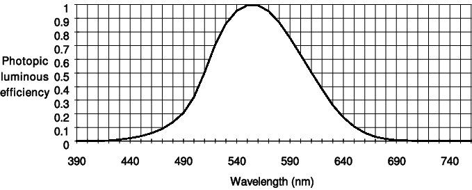
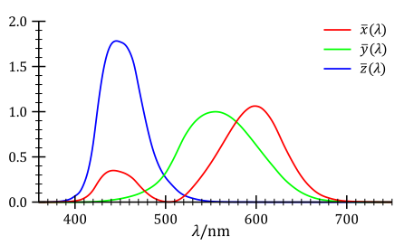
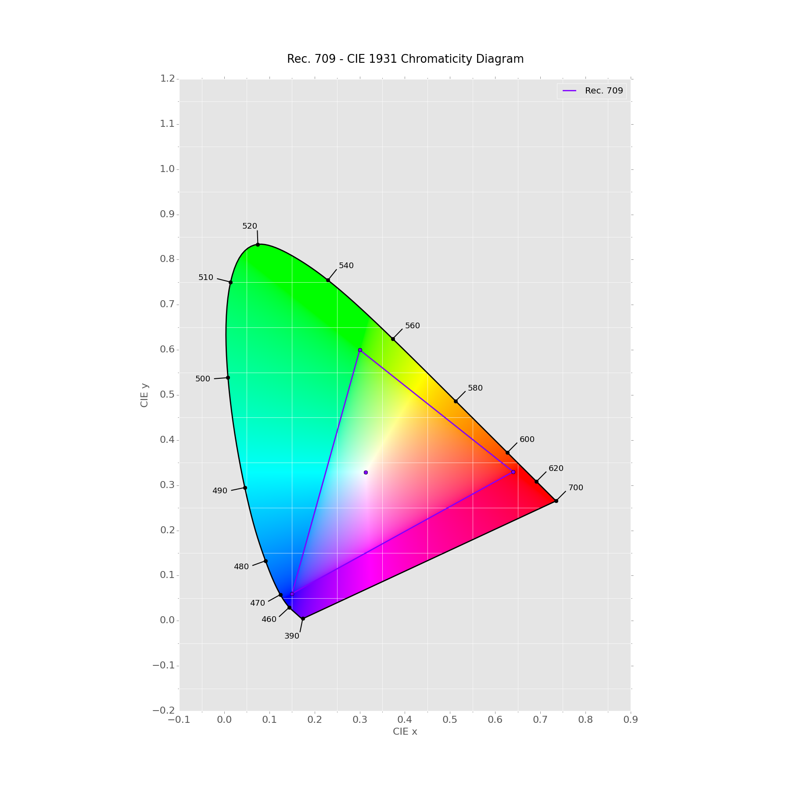

# Light and Color

This is currently a run down of ***Realtime Rendering 4th Edition*** Chapter 8 ***Light and Color***. It will be expanded upon with various other resource when time comes.

## Radiometry and Photometry

| Name              | Symbol   | Units           | Explanation                                          | Equation                          |
| ----------------- | -------- | --------------- | ---------------------------------------------------- | --------------------------------- |
| solid angle       | $\omega$ | steradians (sr) | surface area of a $\dfrac{1}{4\pi}$ unit sphere      | $\omega = \dfrac{A_{patch}}{r^2}$ |
| radiant flux      | $\Phi$   | watt (W)        | power -> flow of radiant energy per time             | measured?                         |
| irradiance        | E        | $W / m^2$       | density of radiant flux per area                     | $\dfrac{d\Phi}{dA}$               |
| radiant intensity | I        | W/sr            | density of radiant flux per steradian                | $\dfrac{d\Phi}{d\omega}$          |
| radiance          | L        | $W/(m^2 sr)$    | density of radiant flux per ray (area and steradian) | $\dfrac{d^2\Phi}{dA d\omega}$     |

Solid angle further reading: [https://mathworld.wolfram.com/SolidAngle.html](https://mathworld.wolfram.com/SolidAngle.html)

***Radiance*** is what is to measured by sensors such as cameras. The value of L along the given ray is equivalent to the shaded surface color at the given surface point. Therefore a ***radiance distribution*** function can be defined as $L_i(x, d)$ where **x** is the 3D position and **d** is the direction (Which is 2D for some reason? TODO: Look into this.). ***Radiance*** is not effected by distance, environmental effects (I think this is intuitive? In case check the equation).

### Spectral power distributions (SPDs)

SPDs are used to visualize the lights's energy of mixed wavelength and break it down into the according wavelengths. Every radiometric quantity can be broken down into different wavelengths and can hence be visualized by a SPD. However in rendering practice SPDs are not used because of performance and practicality. See section for Colorimetry.

Further reading SPDs [https://www.sciencedirect.com/topics/agricultural-and-biological-sciences/spectral-power-distribution](https://www.sciencedirect.com/topics/agricultural-and-biological-sciences/spectral-power-distribution) and [http://hyperphysics.phy-astr.gsu.edu/hbase/vision/spd.html](http://hyperphysics.phy-astr.gsu.edu/hbase/vision/spd.html)

### Photometric Curve

[Source](https://www.researchgate.net/figure/CIE-photometric-curve_fig1_2711215)

The primary difference between radiometric and photometric quantities is that the photometric quantities are just the radiometric quantities but multiplied by the above curve.

| Radiometric               | Photometric                      |
| ------------------------- | -------------------------------- |
| radiant flux: watt (Watt) | luminous flux: lumen (lm)        |
| irradiance: W/m^2         | illuminance: lux (lx)            |
| radiant intensity: W/sr   | luminous intensity: candela (cd) |
| radiance: W/(m^2 sr)      | luminance: cd/m^2 = nit          |

## Colorimetry

Humans have 3 receptors to get information about color and can see 10 million colors hence 3 values can be used to describe every stimulus to the eye. Standardization for measuring color was proposed by the [CIE](http://cie.co.at/) therefore ***color-matching functions*** where introduced. Those color matching functions represent the area under color matching curve such as the following.

[Source](https://commons.wikimedia.org/wiki/File:CIE_1931_XYZ_Color_Matching_Functions.svg)

Therefore the following calculations arise:

$X = \int_{380}^{780} s(\lambda) x(\lambda) d\lambda$

$Y = \int_{380}^{780} s(\lambda) y(\lambda) d\lambda$

$Z = \int_{380}^{780} s(\lambda) z(\lambda) d\lambda$

$s(\lambda)$ denotes the SPD function.

$x(\lambda);y(\lambda);z(\lambda)$ denote the color matching functions.

$X; Y; Z$ denote the color values in the CIE XYZ color space.

### Chromaticity and luminance

Chromaticity describes the character auf the color while luminance describes the brightness of a specific color. This has been mapped on a 2D plane defined by X + Y + Z = 1.

[Source](https://i.stack.imgur.com/XWFpG.png)

We now can reduce the chromaticity to x and y on this plane in order to describe the color independent of its luminosity

[Back](./)
